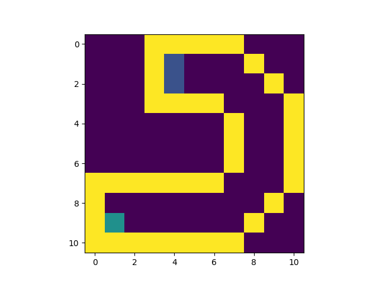
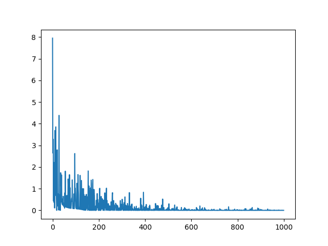
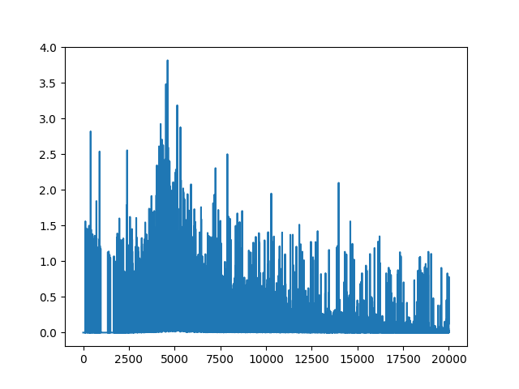

# Pixel Racer with Reinforcement Learning
#### Remarks
This README has been written in a narrative style as opposed to a technical one. Technical resources can be found in the Further Readings. For example a training epoch will be referred to as a training day.

#### Sophie's Objective
Our green pixel racer, Sophie, wants to reach the end of the track. Being a competitive racer, she wants to reach the goal with the least amount of moves! She's going to practice and learn.


## Q-table Learning
With Q-table learning Sophie keeps track of how valuable all possible moves are from every pixel location. In the beginning, she will take a number of random steps to figure out the track. As days pass she will make less random moves and try to optimize how she moves. She figures out how valuable each move is using the Bellman equation.

Training Day 1             |  Training Day 55          |  Training Day 500
:-------------------------:|:-------------------------:|:-------------------------:
  |   | 


## Q-learning using a Neural Network
Sophie has big dreams! Though she trains on a small track now, she wants to compete in the bigger stages and keeping track of every move on every pixel would be very intensive on her memory. Let's resolve this issue by having Sophie figure out the value of each move using a neural network.

Training Day 1             |  Training Day 55          |  Training Day 500
:-------------------------:|:-------------------------:|:-------------------------:
  |   | 

With the same number of training days the results are not as impressive as the Q-table, but she is able to reach the end effectively to a degree.

Loss Graph                  |
:--------------------------:|
|

For this implementation the input to the neural network is a flattened array of the track only containing Sophie's location.

In the future, Sophie would want to be aware of all her surroundings such as obstacles, enemies, etc. Let us train Sophie preserving all information.

## Q-learning using a Neural Network and a Flattened Track

Training Day 1             |  Training Day 500          |  Training Day 1000
:-------------------------:|:-------------------------:|:-------------------------:
  |   | 

With the flattened track array Sophie is not able to reach the end. New complexities arise with the introduction of the new information. We decreased Sophie's learning rate to prevent gradient descent from diverging, but the reduction stops Sophie from effectively learning which moves she must make.

## Experience Buffer and Target Neural Network

We want Sophie to learn from a variety of pixel locations and moves. Currently most of Sophie's training takes place near the starting point. By mixing up her experience, we are able to give her balanced training at each step. This will be done using a experience buffer.

Next we will create a second network that provides the target values for all moves in the primary network. Arthur Juliani describes it best in his [deep reinforcement learning medium post](https://medium.com/@awjuliani/simple-reinforcement-learning-with-tensorflow-part-4-deep-q-networks-and-beyond-8438a3e2b8df):
> The issue with using one network for training is that at every step the Q-network’s values shift. Using a constantly shifting set of values to adjust our network values, the value estimation can spiral out of control. Network becomes destabilized by falling into feedback loops between the target and estimated Q-values.

## The Final Implementation

First, we give Sophie 10,000 steps to take randomly on the track. We store her experiences in a buffer. Throughout her training we give Sophie random samples. Using the target network and her main network, we train her to optimize obtaining her reward. As the training process proceeds we replace part of the experience buffer with more recent experiences and move the weights of the target network slowly towards the weights of the main network.

Voilà!

Training Day 10,000       |
:------------------------:|
 |

Loss graph                 |
:-------------------------:|
 |

Now that Sophie is aware of herself and her environment, we must watch out for her world domination!

## Getting Started
#### Installation
Python3 is required to run Pixel Racer Sophie.

Dependency installation:
```
python setup.py install
```
To train the models for yourself:
```
python -m model.q_nn run
```
On completion you will be presented with a loss graph and the final training actions will be stored in the model_action_output folder.
You can view your racer's actions by running:
```
python -m environment.track_env run <name_of_action_file>
```
This will generate an animation of your racer's actions on the track.
Feel free to build your own tracks by modifying the track world file and train your racer on the new track.

## Future

Sophie's training continues ...

## Thank You and Further Readings

I learned a great amount from the reinforcement learning series by Arthur Juliani. For a deeper technical read on reinforcement learning I would recommend this series.

https://medium.com/emergent-future/simple-reinforcement-learning-with-tensorflow-part-0-q-learning-with-tables-and-neural-networks-d195264329d0

He also links in his series to another great article about deep reinforcement learning, which I found very helpful.

http://neuro.cs.ut.ee/demystifying-deep-reinforcement-learning/